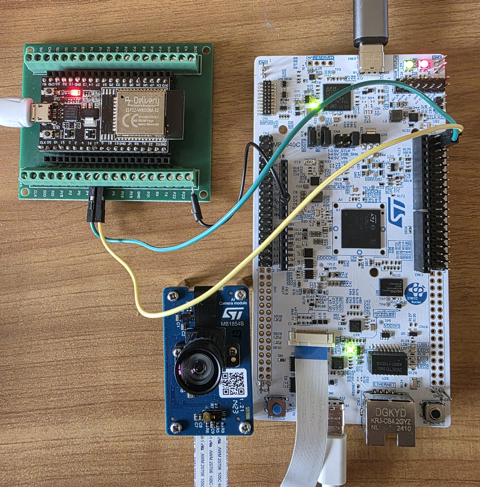

# Standalone Boot Guide: STM32N6 AI People Detection & Tracking

This repository contains the X-CUBE-N6 AI People Detection and Tracking project modified and configured to boot autonomously (Standalone / Boot from Flash) on the **NUCLEO-N657X0-Q** board.

Out of the box, STM32CubeIDE projects for the N6 series are designed to run in attached Debug mode directly from internal RAM (`0x34000000`). This guide details the modifications required to deploy the application persistently into the external Octo-SPI flash so it runs dynamically upon power-up, utilizing the First Stage Boot Loader (FSBL).

---

## ⚠️ The N6 Architecture challenge

The STM32N6 (Cortex-M55, TrustZone/SAU) is devoid of internal application Flash. To run standalone, three critical files must be precisely flashed into the external memory:

1. **The FSBL (`ai_fsbl.hex`)** at `0x70000000`: BootROM loads this. It initializes clocks and RAM, then searches for an application.
2. **The App Payload (`SSBL`)** at `0x70100000`: This is your main code (`detect_person`).
3. **The AI Neural Network Weights (`network_data.hex`)**: A massive ~29MB chunk of intelligence placed automatically far in the external memory by its own `.hex`.

### The `0x400` Alignment Requirement

The STM32N6 hardware requires the main application (SSBL) to be shifted by `0x400` (1024 bytes) in RAM (`0x34000400`) to leave room for a secure Firmware Image Header generated by the ST Signing process.
Because the `.bin` output from STM32CubeIDE starts mathematically at byte `0`, flashing the raw IDE `.bin` directly to `0x70100000` misaligns your Vector Table by exactly 1024 bytes, resulting in a silent **HardFault**.

---

## 🛠️ The Solution: The `-align` Flag

We bypassed this limitation using the undocumented `-align` flag natively available within the STM32 Signing Tool v2.20+ (Header V2.3 format).

This flag takes your raw `.bin` generated by the IDE, automatically injects exactly 1024 bytes of `0x00` padding at the start, recalculates the SSBL authentication signature upon both structures, and outputs a perfectly bootable file.

### Step 1: Linker Script check

Before compiling, ensure your active Linker Script (e.g., `STM32N657xx_nucleo.ld`) defines the internal RAM (Execution space) properly starting at the `0x400` boundary:

```ld
AXISRAM1_2_S (xrw) : ORIGIN = 0x34000400, LENGTH = 2047K
```

*If this starts at `0x34000000`, the execution will crash because pointers will point into the zero-padding.*

### Step 2: Compiling the RAW Binary

Compile your codebase via STM32CubeIDE in Release or Debug mode. This produces the raw binary:
`x-cube-n6-ai-people-detection-tracking-uvc-nucleo.bin`

### Step 3: Flash Automation (`Flash_Nucleo_Tracking.bat`)

Never attempt to manually slice/dice the 1024-byte header using Hex/Python parsers! Use the provided `Flash_Nucleo_Tracking.bat` script.

The script automates these steps using `STM32_SigningTool_CLI` and `STM32_Programmer_CLI`:

1. **Sign and Align:**

   ```bat
   STM32_SigningTool_CLI.exe -bin "RAW_App.bin" -nk -t ssbl -hv 2.3 -align -o "N6_Aligned_Signed.bin"
   ```

2. **Flash the FSBL:** `STM32_Programmer_CLI -w ai_fsbl.hex` (Erases the `0x700` sector).
3. **Flash AI Weights:** `STM32_Programmer_CLI --skipErase -w network_data.hex`
4. **Flash Aligned App:** `STM32_Programmer_CLI --skipErase -w N6_Aligned_Signed.bin 0x70100000`

> **Note on `--skipErase`:** It is mandatory during steps 3 and 4! If omitted, STM32CubeProgrammer will perform a global bulk-erase, wiping the FSBL you just installed in step 2.

---

## 🚀 Running the System

1. Double-click the `Flash_Nucleo_Tracking.bat`.
2. Wait for completion (Loading the AI network weights takes ~60-90 seconds).
3. **Important:** Firmly switch the physical board Jumper to **BOOT FROM FLASH**.
4. **Power Cycle:** Physically disconnect the USB C cable from the Nucleo board, then plug it back in.
   *(This ensures the JTAG/SWD Debugger built into the board completely disengages the processor HALT state.)*
5. The AI People Tracking software should instantly stream output to the serial console and run neural network detections!

---

## 📡 Wi-Fi & MQTT Integration (ESP32)

To enable wireless communication and send the AI detection data (e.g., number of tracked people) over Wi-Fi, this project supports integration with an external ESP32 module.

The STM32N657X0-Q Nucleo board streams the person count via its main serial port (USART1 at 115200 bps). An ESP32 can be connected via its hardware serial port (`Serial2`) to listen to this output, parse the JSON payload (e.g., `{ "person", 3 }`), and publish it to an MQTT broker.

### Hardware Connection (Nucleo N6 to ESP32)

1. **STM32 GND** <-> **ESP32 GND**
2. **STM32 TX (PE5)** <-> **ESP32 RX2 (Pin 16)**

The Arduino code for the ESP32 is included in the `ESP32_N657X0_Q` folder. It features Multi-WiFi connection logic and uses a `secrets.h` file (which is ignored by Git) to keep your Wi-Fi credentials and MQTT passwords safe.



---

## 📷 Remote UVC Webcam Control via MQTT

This project supports **remotely enabling or disabling the UVC webcam stream** over MQTT, which is useful when no PC is available to view the video feed and you want to **save energy**.

> The AI person detection and MQTT data publishing continue to operate normally regardless of the webcam state.

### How It Works

When the ESP32 receives a command message on the **inbound MQTT topic**, it forwards the payload to the STM32 Nucleo board over the hardware serial port (`Serial2` → `USART1`). The firmware parses the message and dynamically enables or disables the UVC video stream.

### MQTT Topics

| Direction | Topic | Description |
|-----------|-------|-------------|
| Outbound (detections) | `FABLAB_21_22/nucleoN657/detect/out/` | Published by the ESP32 with person count |
| **Inbound (commands)** | `FABLAB_21_22/nucleoN657/detect/in/` | Subscribed by the ESP32 to receive webcam control commands |

### Payload Format

Send a JSON message to the inbound topic:

```json
{"webcam":0}
```

| Value | Effect |
|-------|--------|
| `{"webcam":0}` | **Disables** the UVC webcam stream → saves energy |
| `{"webcam":1}` | **Re-enables** the UVC webcam stream |

### Full Message Flow

```
[MQTT Client]  --publishes-->  FABLAB_21_22/nucleoN657/detect/in/
                               payload: {"webcam":0}
                                    |
                                    ▼
             [ESP32]  mqttCallback() detects "webcam" key
                      Serial2.println(payload)  →  TX2 pin 17
                                    |
                                    ▼
             [STM32 Nucleo]  USART1 RX interrupt (PE6)
                             HAL_UART_RxCpltCallback() parses payload
                             → headless_mode_active = 1  (UVC OFF)
                             → UVC frame copy suspended, AI still running
```

### Hardware Wiring for Bidirectional Communication

| Signal | STM32 Nucleo Pin | ESP32 Pin |
|--------|-----------------|-----------|
| GND    | GND             | GND       |
| TX (detections → ESP32) | PE5 (USART1 TX) | GPIO 16 (RX2) |
| RX (commands ← ESP32)   | PE6 (USART1 RX) | GPIO 17 (TX2) |

> **Note:** The ESP32 `TX2` pin (17) must be connected to the STM32 `USART1 RX` pin (PE6) to enable the downlink command path.

---

## 🚶 Line-Crossing People Counter (Bidirectional)

This project implements a **real-time bidirectional people counting** feature based on an imaginary virtual line drawn across the video frame. Using the tracker's persistent IDs, the system detects each time a person crosses the line and increments either an **IN** or **OUT** counter depending on the direction of travel.

> This feature requires `TRACKER_MODULE` to be enabled (defined at compile time).

### How It Works

A virtual line is defined at a configurable position across the screen (default: horizontal line at 50% of frame height). On every frame, each tracked person's smoothed centroid position is compared against this line. When the centroid crosses from one side to the other, the corresponding counter is incremented.

An **anti-bounce guard** prevents multiple counts for the same crossing: the counter is only triggered once per actual traversal, and resets only when the person moves back to the original side.

```
         Camera Frame (320×240 for Nucleo N657X0-Q)
┌─────────────────────────────────────┐
│                                     │
│  IN :  5   ◄── displayed above line │
│─────────────────────────────────────│  ← yellow line at y=120px
│  OUT:  3   ◄── displayed below line │
│                                     │
└─────────────────────────────────────┘

  Person walking ↓ → increments IN
  Person walking ↑ → increments OUT
```

### Configuration

Both the position and orientation of the virtual line are defined as compile-time constants at the top of `Src/app.c`:

```c
#define LINE_CROSS_POS  0.50f   // Line position: 0.0 = top/left, 1.0 = bottom/right
#define LINE_AXIS       0       // 0 = horizontal line, 1 = vertical line
```

| Parameter | Value | Description |
|-----------|-------|-------------|
| `LINE_CROSS_POS` | `0.50f` | Line at 50% of frame (centre) |
| `LINE_AXIS` | `0` | Horizontal line (crossing = vertical movement) |

To move the line to the upper third of the screen, set `LINE_CROSS_POS 0.33f`. To use a vertical line instead (e.g. for a doorway viewed from above), set `LINE_AXIS 1`.

### Visual Overlay on UVC Stream

When tracking is active, the following elements are overlaid on the UVC video stream visible on the connected PC:

- 🟡 **Yellow line** drawn across the frame at the configured position
- **`IN : N`** counter displayed just above the line
- **`OUT: N`** counter displayed just below the line
- Each tracked bounding box retains its ID label and trajectory trail

### MQTT Topics & Payload Format

Two types of messages are published by the ESP32:

#### 1. Periodic Count Message (on stable person count change)

Published to: `FABLAB_21_22/nucleoN657/detect/out/`

```json
{ "person": 2, "in": 5, "out": 3 }
```

| Field | Description |
|-------|-------------|
| `person` | Number of people **currently visible** in the frame |
| `in` | Cumulative count of crossings in the **IN direction** (since boot) |
| `out` | Cumulative count of crossings in the **OUT direction** (since boot) |

#### 2. Instant Crossing Event (fired at the moment of each crossing)

Published to: `FABLAB_21_22/nucleoN657/crossing/`

```json
{ "event": "crossing", "dir": "IN", "id": 7, "in": 5, "out": 3 }
```

| Field | Description |
|-------|-------------|
| `event` | Always `"crossing"` |
| `dir` | `"IN"` or `"OUT"` depending on crossing direction |
| `id` | Tracker ID of the person who crossed the line |
| `in` / `out` | Updated cumulative counters at time of crossing |

> **Note:** Counters are reset to zero on board power cycle. They are not persisted to flash.
